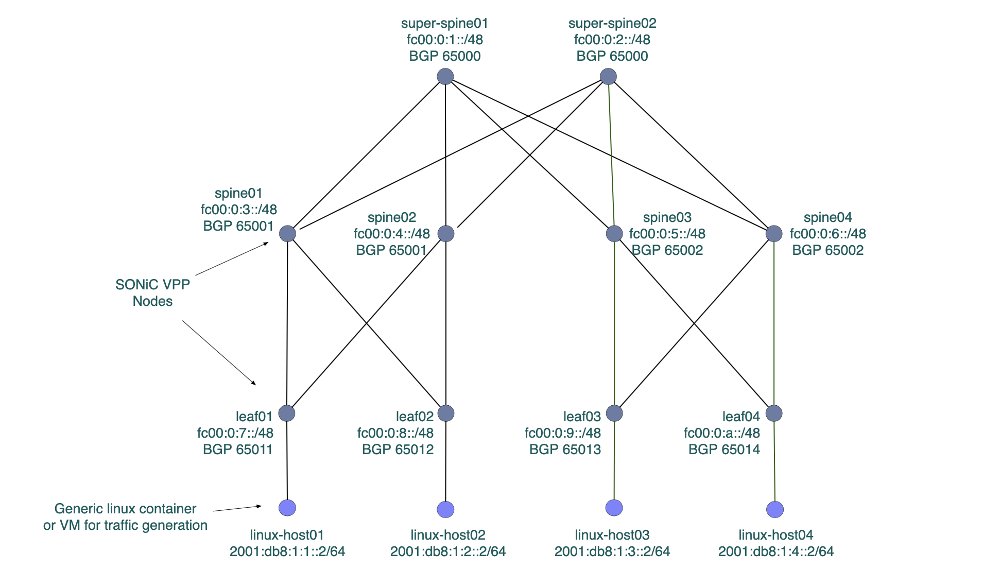

### sonic-vpp base topology




1. Install VXR
2. Create VXR topology yaml file: [example](./sonic-vxr.yml)

```
sudo vxr.py start <filename>
```

3. It can take up to 7 or 8 minutes for all nodes to come up and SWSS and FRR be ready
   
4. Run Ansible sonic-vpp playbook to configre nodes (config_db.json and frr.conf). Note, the playbook also creates user cisco with password cisco123 and sudo permission for easier login to the devices.

```
cd ansible
ansible-playbook -i hostssonic-config-playbook.yml
```

5. Ansible playbook to deploy frr SRv6 configuration - hopefully this step will be removed in the future
```
ansible-playbook -i hosts sonic-srv6-playbook.yml
```

6. Run ansible ping test playbook
```
ansible-playbook -i hosts srv6-pingtest-playbook.yml
```

7. Run a constant ping from topology-host to Vrf1 netns at 09-leaf Ethernet8

```
sudo ping -i .3 fc00:0:f800:4::2
```

8. Run tcpdump along the Vrf1 path
```
sudo tcpdump -i br16 
sudo tcpdump -i br08
sudo tcpdump -i br00
sudo tcpdump -i br03
sudo tcpdump -i br14
sudo tcpdump -i br20
```

9. Run a constant ping from topology-host to Vrf2 netns at 10-leaf Ethernet12

```
sudo ping -i .3 fc00:0:f800:7::2
```

10. Run tcpdump along the Vrf2 path
```
sudo tcpdump -i br19 
sudo tcpdump -i br11
sudo tcpdump -i br05
sudo tcpdump -i br06
sudo tcpdump -i br13
sudo tcpdump -i br23
```

### Troubleshooting

Accessing VPP 
```
docker exec -it syncd bash
vppctl -s /run/vpp/cli.sock
```

VPP commands
```
show sr localsids
show sr policies
show sr steering-policies
show sr encaps source addr 
```

SAI Redis logs
```
sudo tail -f /var/log/syslog /var/log/swss/sairedis.rec 
```